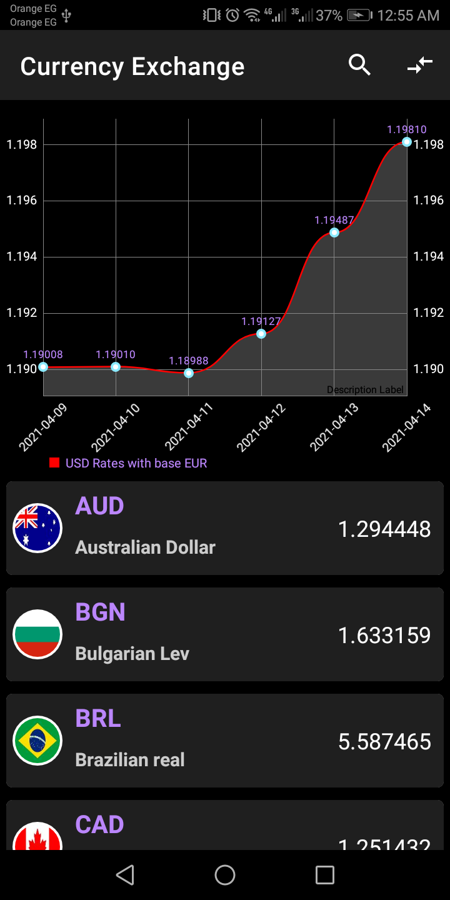
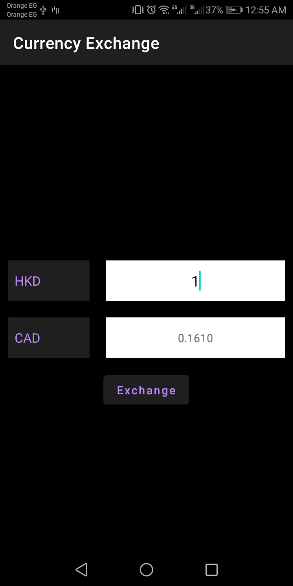

# CurrencyExchange

Android Application to get currency exchange rates for more than 180 currency from API,
and draw line chart for the exchange rates in the last week between the USD and curreny base currency, 
and you can also change the current base currency

   

### Tools and Techniques:
- Kotlin
- RxJava
- MVVM Architecture
- Dagger2
- LeackCanary
- MPAndroidChart
- Circleimageview
